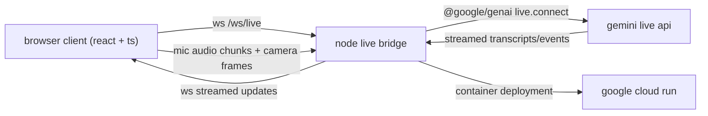

# architecture

```mermaid
flowchart LR
    A["browser client (react + ts)"] -->|"ws /ws/live"| B["node live bridge"]
    A -->|"mic audio chunks + camera frames"| B
    B -->|"@google/genai live.connect"| C["gemini live api"]
    C -->|"streamed transcripts/events"| B
    B -->|"ws streamed updates"| A
    B -->|"container deployment"| D["google cloud run"]
```
